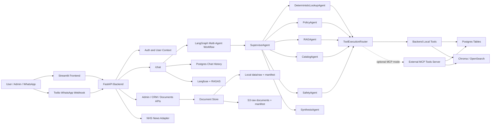
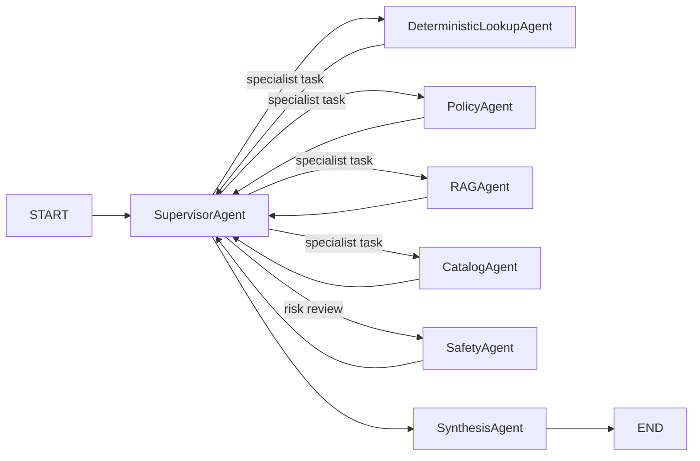

# dstrmaysam-healthcare-knowledge-multi-agent

Healthcare knowledge assistant with a FastAPI backend, Streamlit frontend, supervisor-led LangGraph multi-agent workflow, table-backed Postgres lookup, document RAG, Hospital CRM, Langfuse/RAGAS observability, optional MCP tool execution, Twilio WhatsApp integration, and AWS dev infrastructure.

The system is built for internal healthcare knowledge work. Staff can ask operational, policy, document, and safety questions. Admins can manage users, upload and index documents, maintain CRM data, inspect query telemetry, and switch tool execution between local backend tools and an external MCP server.

## Current Capabilities

- Authenticated Streamlit app with Chat, News, Dashboard, Hospital CRM, Users, Documents, and Settings sections.
- FastAPI backend for auth, chat, document ingestion, metadata, CRM CRUD, dashboard telemetry, tool settings, and Twilio WhatsApp webhooks.
- In-process LangGraph multi-agent workflow with specialist agents and final synthesis.
- Azure OpenAI chat and embedding support, with local fallback responses when LLM configuration is unavailable.
- RAG over uploaded PDF, DOCX, markdown, and text documents.
- Local Chroma retrieval for local development and OpenSearch Serverless retrieval for AWS mode.
- Table-backed Postgres deterministic lookup for patients, doctors, departments, wards, appointments, rota/on-call, contacts, formulary, equipment, finance, compliance, training, and CRM data.
- CSV upload sync into supported Postgres tables. Unsupported CSV shapes are rejected with mapping guidance.
- Metadata-only manifest records for Postgres lookup tables so deterministic data can be discovered by the supervisor/catalog.
- Optional MCP tool execution mode. Agent reasoning stays in the backend; selected tool calls can execute on an external MCP server.
- Shared tool package in `backend/packages/healthcare_tools_core` so backend-local tools and MCP tools can use the same lookup/search implementation.
- Role-aware document and structured-data access filtering.
- Langfuse tracing, prompt loading, trace enrichment, and optional RAGAS score publishing.
- Offline golden dataset evaluation, stress testing, and pre-push smoke testing.
- Docker Compose local stack and AWS CloudFormation/CodePipeline/ECS deployment assets.

## Architecture



Important boundaries:

- The backend owns supervisor routing, specialist selection, specialist tool choice, arbitration, safety review, and synthesis.
- MCP is tool execution only. It does not run the agent graph.
- There is no deterministic preflight shortcut before the graph. Deterministic lookup is a specialist path inside the graph.
- Fresh installs do not use a generic CSV row lookup table for chat answers. CSV data is synced into controlled Postgres tables.

## Repository Layout

```text
backend/app/                         FastAPI API, agents, auth, config, ingestion, retrieval, storage, observability
backend/packages/healthcare_tools_core Shared tool package used by backend local tools and the MCP server
frontend/                            Streamlit application
database/init/                       Postgres schema and seeded healthcare data
data/                                Local raw documents, Chroma data, manifests, and local secrets
docs/                                Architecture, MCP, AWS, and system documentation
evals/                               Golden datasets, RAGAS runner, and stress tests
infra/                               AWS CloudFormation, ECS, CodePipeline, db-init, and deployment docs
tests/                               Unit and regression tests
.githooks/                           Git pre-push hook
```

## Quick Start - Local

PowerShell:

```powershell
Copy-Item .env.example .env
docker compose up --build
```

Bash:

```bash
cp .env.example .env
docker compose up --build
```

Local services:

- Frontend: `http://localhost:8501`
- Backend API: `http://localhost:8000`
- Postgres: `localhost:5432`

Docker Compose starts only the healthcare stack:

- `backend`
- `frontend`
- `postgres`

It does not start an MCP container. The MCP server is an external service from `C:\Users\Sabin\Documents\ITC Projects\MCP-Tools`.

## Local Configuration

The default `.env.example` is local-first:

```env
APP_ENV=local
CHAT_HISTORY_BACKEND=postgres
LOCAL_TOOL_EXECUTION_MODE=local
LOCAL_MCP_SERVER_URL=http://host.docker.internal:9000/sse
LOCAL_MCP_PROJECT_ID=dstrmaysam-healthcare-knowledge-multi-agent
LOCAL_MCP_TOOL_FALLBACK_TO_LOCAL=false
```

Local auth/session configuration is read from:

```env
LOCAL_APP_SECRET_FILE=/app/data/local_app_secret.json
```

If this file does not exist, the backend creates it with a generated session secret and the configured local user values. To inject the simple local admin overlay for development:

```env
LOCAL_TEST_ADMIN_ENABLED=true
LOCAL_TEST_ADMIN_USERNAME=admin
LOCAL_TEST_ADMIN_PASSWORD=admin123
```

With `LOCAL_TEST_ADMIN_ENABLED=false`, use the users stored in `LOCAL_APP_SECRET_FILE` or create/update users through the app after authenticating with an existing admin.

Azure OpenAI local variables:

```env
AZURE_OPENAI_ENDPOINT=https://<your-resource>.openai.azure.com/
AZURE_OPENAI_API_KEY=<your-key>
AZURE_OPENAI_API_VERSION=2024-12-01-preview
AZURE_OPENAI_DEPLOYMENT=gpt-4.1-mini
AZURE_OPENAI_EMBEDDING_DEPLOYMENT=text-embedding-3-small
```

If Azure OpenAI configuration is missing, chat can still return safe fallback responses, but RAG, synthesis quality, and RAGAS scoring will be degraded.

## Runtime Modes

### Local Mode

Local mode uses:

- environment variables and `LOCAL_APP_SECRET_FILE` for secrets
- local Postgres from Docker Compose
- local document storage under `data/raw`
- local manifest under `data/manifests/documents.json`
- local Chroma under `data/chroma`
- backend-local tool execution unless switched to MCP

### AWS Mode

AWS mode uses:

- Secrets Manager for app, Azure OpenAI, Langfuse, and MCP settings
- S3 for raw documents and the manifest
- OpenSearch Serverless for retrieval
- RDS Postgres for CRM data, deterministic lookup, and chat history
- ECS task roles for AWS credentials
- ALB/ECS for backend and frontend dev services
- optional healthcare MCP ECS service and/or shared MCP service

Core AWS names:

```text
Base name: dstrmaysam-healthcare-knowledge-multi-agent-dev
Short name: dstrmaysam-hkm-dev
Region: eu-west-2
```

Expected AWS secret names:

```text
/dstrmaysam-healthcare-knowledge-multi-agent-dev/app
/dstrmaysam-healthcare-knowledge-multi-agent-dev/azure-openai
/dstrmaysam-healthcare-knowledge-multi-agent-dev/langfuse
/dstrmaysam-healthcare-knowledge-multi-agent-dev/mcp-tools
```

In AWS mode, tool execution settings are read from the app secret and can be edited in the Streamlit Settings section:

```json
{
  "tool_execution_mode": "mcp",
  "mcp_server_url": "http://internal-dstrmaysam-shared-mcp-alb-748190876.eu-west-2.elb.amazonaws.com/sse",
  "mcp_project_id": "dstrmaysam-healthcare-knowledge-multi-agent",
  "mcp_tool_timeout_seconds": 30,
  "mcp_tool_fallback_to_local": true
}
```

Available MCP URL presets in Settings:

- Shared MCP Server: `http://internal-dstrmaysam-shared-mcp-alb-748190876.eu-west-2.elb.amazonaws.com/sse`
- Healthcare MCP Server: `http://mcp-tools.dstrmaysam-hkm-dev.local:9000/sse`

The secret stores the selected URL value, not the display label.

Useful chat/retrieval runtime knobs:

```env
CHAT_FAST_RAG_ENABLED=false
CHAT_FAST_PLANNED_EXECUTION_ENABLED=true
MAX_GRAPH_LLM_CALLS=10
LLM_INPUT_COST_PER_MILLION_TOKENS=0.40
LLM_OUTPUT_COST_PER_MILLION_TOKENS=1.60
RAG_TOP_K=10
RAG_NEIGHBOR_CHUNKS=1
RAG_PARALLEL_SEARCH_ENABLED=true
LANGFUSE_PROMPT_CACHE_TTL_SECONDS=300
```

## Multi-Agent Workflow

Every online chat request enters the multi-agent graph:



Current agents:

- `SupervisorAgent`: chooses specialist agents, splits multipart queries, arbitrates specialist reports, applies route guardrails, and decides when evidence is sufficient.
- `DeterministicLookupAgent`: chooses Postgres/table tools for operational facts, table row lookups, counts, lists, rota, patients, appointments, wards, equipment, formulary, contacts, finance, and CRM data.
- `PolicyAgent`: chooses policy retrieval for SOP, policy, pathway, guideline, compliance, retention, governance, and procedure questions.
- `RAGAgent`: chooses document retrieval for general document-content questions.
- `CatalogAgent`: chooses catalog tools for document inventory and metadata questions.
- `SafetyAgent`: reviews urgent, risky, PHI, clinical safety, escalation, and missing-source concerns.
- `SynthesisAgent`: writes the final answer from specialist reports and evidence.

Tool ownership:

| Agent | Tools |
|---|---|
| `SupervisorAgent` | No backend tools. Chooses specialists only. |
| `DeterministicLookupAgent` | `postgres_deterministic_lookup`, `formulary_table_lookup`, `calendar_rota_lookup`, `table_lookup` |
| `PolicyAgent` | `policy_search` |
| `RAGAgent` | `document_search`, `rag_search` |
| `CatalogAgent` | `catalogue_search`, `document_catalog` |
| `SafetyAgent` | `safety_guard` |
| `SynthesisAgent` | No tools. Writes final response. |

The dashboard per-query overlay shows:

- supervisor and specialist sequence
- selected agents
- selected tools
- source count and latency
- actual tool execution location, including MCP success or local fallback
- RAGAS status and scores when available

## Tool Execution

The same specialist tool choice path is used in local and MCP modes.

Local mode:

```text
SpecialistAgent -> ToolExecutionRouter -> Backend local tools -> Postgres / Chroma / OpenSearch / S3
```

MCP mode:

```text
SpecialistAgent -> ToolExecutionRouter -> MCP server -> shared healthcare tool package -> Postgres / OpenSearch / S3
```

If `mcp_tool_fallback_to_local=true`, MCP failures fall back to backend-local tools. The per-query overlay records this as `mcp_failed_local_fallback`, so you can tell when a response was not actually served by MCP.

The shared package used by both modes lives at:

```text
backend/packages/healthcare_tools_core
```

The external MCP server should install or copy this package so deterministic lookup and retrieval behavior stays equivalent to backend-local tool execution.

## Documents And Ingestion

Admins can upload and index documents from the Documents section.

Supported document uploads:

- PDF
- DOCX
- TXT
- MD
- CSV with a supported table mapping

Non-CSV ingestion:

1. Stores the raw file locally or in S3.
2. Preserves document metadata such as category, document type, and access roles.
3. Parses and chunks text.
4. Embeds chunks.
5. Writes vectors to Chroma or OpenSearch.
6. Updates the manifest.

Default chunking:

```env
INGESTION_CHUNK_SIZE=1500
INGESTION_CHUNK_OVERLAP=250
RAG_TOP_K=10
RAG_NEIGHBOR_CHUNKS=1
```

Re-indexing a changed document deletes old chunks for that document before writing new chunks. Metadata edits are preserved across ingestion/indexing for the same document.

CSV ingestion:

- Supported CSVs are synced into controlled Postgres tables.
- Raw CSV files are retained only after validation succeeds.
- Metadata-only manifest records point to `postgres://table/<table_name>`.
- Unsupported CSVs return `400` with supported mapping guidance.
- Chat lookup does not answer from arbitrary CSV row blobs.

Supported table-backed lookup areas include:

- `patients`
- `doctors`
- `departments`
- `wards`
- `appointments`
- `staff_schedule`
- `clinic_sessions`
- `equipment_assets`
- `formulary`
- `organization_contacts`
- `finance_records`
- `compliance_audits`
- `training_records`

Run ingestion from the backend container:

```bash
docker compose run --rm backend python -m app.ingest
```

## Hospital CRM

The Hospital CRM provides CRUD and search/filter views for operational Postgres tables.

Main CRM sections:

- Patients
- Doctors
- Departments
- Schedule
- Appointments
- Finance

The "All tables" selector also exposes other managed tables such as wards, contacts, formulary, clinic sessions, equipment assets, compliance audits, and training records.

The CRM is the source of truth for deterministic operational lookup. Questions that previously depended on CSV lookup now use the Postgres tables and their manifest metadata.

Example deterministic questions:

- `who is on call tomorrow`
- `is anybody from radiology on call next week`
- `details for patient Lucy Hall`
- `does John Spencer have appointments`
- `how many defibrillators are available`
- `info on dopamine`
- `how do I contact oncology`
- `list all departments`

## Frontend Sections

Main:

- `Chat`: multi-agent chat with transient "What is being done" progress and previous chat sessions.
- `News`: NHS/health news feed.

Admin:

- `Dashboard`: usage, latency, per-query details, RAGAS, tool execution, and multi-agent decision tree.
- `Hospital CRM`: table-backed CRM CRUD.
- `Users`: user management and password reset.
- `Documents`: upload, index, metadata edit, bulk edit, row detail, and delete.
- `Settings`: tool execution mode, MCP URL, MCP project ID, timeout, and fallback settings from the app secret.

## API Surface

Core endpoints:

- `GET /health`
- `GET /system/manifest-status`
- `GET /news`
- `POST /auth/login`
- `GET /auth/me`
- `POST /auth/change-password`
- `POST /chat`
- `POST /twilio/whatsapp/webhook`
- `GET /chat/sessions`
- `GET /chat/sessions/{session_id}`
- `GET /documents`

Admin endpoints:

- `GET /admin/users`
- `POST /admin/users`
- `PATCH /admin/users/{username}`
- `POST /admin/users/{username}/reset-password`
- `GET /admin/settings/tool-execution`
- `PATCH /admin/settings/tool-execution`
- `POST /admin/documents/upload`
- `PATCH /admin/documents/metadata`
- `DELETE /admin/documents/{document_key:path}`
- `POST /admin/documents/delete-indexes`
- `POST /admin/documents/ingest`
- `GET /admin/dashboard`
- `POST /admin/warmup`
- `GET /admin/patient-details`
- `GET /admin/crm/sections`
- `GET /admin/crm/{section}`
- `POST /admin/crm/{section}`
- `PATCH /admin/crm/{section}/{record_id}`
- `DELETE /admin/crm/{section}/{record_id}`

## Twilio WhatsApp

The WhatsApp adapter uses the same `/chat` workflow as the Streamlit app.

Webhook:

```text
POST /twilio/whatsapp/webhook
```

Local testing usually needs a public tunnel and a matching webhook URL:

```text
https://<your-ngrok-domain>/twilio/whatsapp/webhook
```

AWS should use a public HTTPS endpoint or domain. If you use a non-standard port, the exact port must be included in the Twilio webhook URL and in the value used for signature validation.

App secret keys:

```json
{
  "twilio_whatsapp_enabled": false,
  "twilio_account_sid": "",
  "twilio_auth_token": "",
  "twilio_whatsapp_from": "whatsapp:+14155238886",
  "twilio_whatsapp_webhook_url": "https://YOUR-DOMAIN/twilio/whatsapp/webhook",
  "twilio_whatsapp_async_enabled": true,
  "twilio_whatsapp_allow_unmapped": false,
  "twilio_whatsapp_default_roles": ["staff"],
  "twilio_whatsapp_default_departments": [],
  "twilio_whatsapp_users": {
    "+447700900000": {
      "user_id": "sabin",
      "roles": ["admin", "doctor", "staff"],
      "departments": ["clinical_governance", "operations"],
      "enabled": true
    }
  },
  "twilio_whatsapp_max_reply_chars": 1400
}
```

Keep `twilio_whatsapp_allow_unmapped=false` unless anonymous staff-level access is intended.

## Secrets

Do not commit real API keys, passwords, token signing secrets, or Langfuse credentials.

App secret example:

```json
{
  "session_secret": "replace-with-long-random-value",
  "auth_users": {
    "admin": "pbkdf2_sha256$200000$salt_hex$hash_hex"
  },
  "user_profiles": {
    "admin": {
      "roles": ["admin", "doctor", "staff"],
      "departments": ["clinical_governance", "operations"],
      "password_change_required": false
    }
  },
  "tool_execution_mode": "local",
  "mcp_server_url": "http://host.docker.internal:9000/sse",
  "mcp_project_id": "dstrmaysam-healthcare-knowledge-multi-agent",
  "mcp_tool_timeout_seconds": 30,
  "mcp_tool_fallback_to_local": false
}
```

Azure OpenAI secret example:

```json
{
  "endpoint": "https://YOUR-RESOURCE.openai.azure.com/",
  "api_key": "azure-openai-key",
  "api_version": "2024-12-01-preview",
  "chat_deployment": "gpt-4.1-mini",
  "fast_chat_deployment": "gpt-4.1-mini",
  "embedding_deployment": "text-embedding-3-small"
}
```

Langfuse secret example:

```json
{
  "public_key": "pk-lf-...",
  "secret_key": "sk-lf-...",
  "base_url": "https://cloud.langfuse.com"
}
```

Generate a password hash:

```bash
python -m backend.app.auth hash-password
```

Inside the backend container:

```bash
python -m app.auth hash-password
```

## AWS Deployment

The AWS foundation template is:

```text
infra/aws-foundation.yml
```

It creates or configures:

- S3 bucket
- S3 Gateway Endpoint
- Secrets Manager secrets
- RDS Postgres
- OpenSearch Serverless collection and policies
- ECR repositories
- ECS cluster
- backend/frontend ALB and ECS services when `CicdEnabled=true`
- CodePipeline, CodeBuild, and ECS deploy actions
- db-init ECS task for schema and seed SQL
- optional healthcare MCP runtime resources
- IAM roles and policies
- log groups
- optional Transit Gateway attachment parameters for shared MCP access

Required tags:

```text
Project=dstrmaysam-healthcare-knowledge-multi-agent
Application=dstrmaysam
Owner=Sabin
```

Minimal PowerShell deploy shape:

```powershell
$env:STACK_NAME = "dstrmaysam-healthcare-knowledge-multi-agent-dev"
$env:CFN_ARTIFACT_BUCKET = "dstrmaysam-healthcare-knowledge-multi-agent-dev-cfn-artifacts"
$env:AWS_REGION = "eu-west-2"

aws s3api head-bucket --bucket $env:CFN_ARTIFACT_BUCKET 2>$null
if ($LASTEXITCODE -ne 0) {
  aws s3api create-bucket `
    --bucket $env:CFN_ARTIFACT_BUCKET `
    --region $env:AWS_REGION `
    --create-bucket-configuration LocationConstraint=$env:AWS_REGION
}

aws cloudformation deploy `
  --stack-name $env:STACK_NAME `
  --template-file infra/aws-foundation.yml `
  --s3-bucket $env:CFN_ARTIFACT_BUCKET `
  --s3-prefix cloudformation `
  --region $env:AWS_REGION `
  --capabilities CAPABILITY_NAMED_IAM `
  --parameter-overrides `
    CicdEnabled=true `
    CodeStarConnectionArn=arn:aws:codeconnections:eu-west-2:ACCOUNT_ID:connection/CONNECTION_ID `
    RepositoryId=sabin262/dstrmaysam-heakthcare-knowledge-agent-multi-agent `
    RepositoryBranch=master `
    PublicIngressCidr=0.0.0.0/0 `
    BackendDesiredCount=1 `
    FrontendDesiredCount=1 `
    McpDesiredCount=0
```

Use `--s3-bucket` because the CloudFormation template is larger than the direct upload limit.

After deploy, useful outputs:

```powershell
aws cloudformation describe-stacks `
  --stack-name $env:STACK_NAME `
  --region $env:AWS_REGION `
  --query "Stacks[0].Outputs"
```

More detail:

- `infra/README.md`
- `docs/aws_setup_instructions.md`
- `infra/deploy command.md`

## MCP Deployment

There are two MCP patterns:

1. Healthcare-stack MCP service:
   - Runtime resources are owned by `infra/aws-foundation.yml`.
   - ECS service runs in the healthcare VPC.
   - Private URL is exposed through Cloud Map.
   - Dev public URL can be exposed through the ALB.
   - The MCP repo pipeline builds and deploys the MCP image into this service.

2. Shared MCP stack:
   - Lives in `C:\Users\Sabin\Documents\ITC Projects\MCP-Tools`.
   - Can serve multiple projects.
   - Uses project-level secrets such as `/dstrmaysam-healthcare-knowledge-multi-agent-dev/mcp-tools`.
   - Can connect to the healthcare VPC/RDS through Transit Gateway routing when configured.

The healthcare backend setting `mcp_server_url` decides which MCP endpoint is used for tool calls.

## Evaluation And Testing

Run tests:

```bash
python -m pytest tests -q
```

Run compile validation:

```bash
python -m compileall backend frontend tests -q
```

Enable the pre-push hook:

```bash
git config core.hooksPath .githooks
```

The lightweight pre-push smoke test file is:

```text
tests_pre_push/
```

### Golden Dataset Eval

Default dataset:

```text
evals/healthcare_golden_dataset.csv
```

It is aligned with the AWS deployed source model:

- operational facts from Postgres tables
- policy/content answers from indexed documents
- catalog answers from manifest metadata
- no generic `uploaded_lookup_rows` source expectation

Run against local:

```bash
python evals/run_ragas_eval.py --api-url http://localhost:8000 --token YOUR_TOKEN
```

Run against AWS:

```bash
python evals/run_ragas_eval.py --api-url http://YOUR-AWS-BACKEND-URL --token YOUR_TOKEN
```

Publish to Langfuse:

```bash
python evals/run_ragas_eval.py --api-url http://YOUR-AWS-BACKEND-URL --token YOUR_TOKEN --publish-langfuse --secrets-stage dev
```

### Stress Test

```bash
python evals/stress_test.py --api-url http://YOUR-AWS-BACKEND-URL --token YOUR_TOKEN
```

The stress test uses 20 AWS-aligned base cases with 5 paraphrases each and reports latency, failures, answer similarity, source overlap, expected source misses, and expected tool misses.

## Useful Commands

Check backend health:

```bash
curl http://localhost:8000/health
```

Check manifest status:

```bash
curl http://localhost:8000/system/manifest-status
```

Run ingestion:

```bash
docker compose run --rm backend python -m app.ingest
```

Tail local containers:

```bash
docker compose logs -f backend
docker compose logs -f frontend
```

Check AWS stack events:

```powershell
aws cloudformation describe-stack-events `
  --stack-name dstrmaysam-healthcare-knowledge-multi-agent-dev `
  --region eu-west-2
```

## Key Documentation

- `docs/system_summary.md`
- `docs/multi_agent_chat_regression_context.md`
- `docs/mcp_tool_execution.md`
- `docs/aws_setup_instructions.md`
- `infra/README.md`
- `docs/multi_agent_conversion_proposal.md`
- `docs/multi_agent_conversion_implementation_plan.md`
