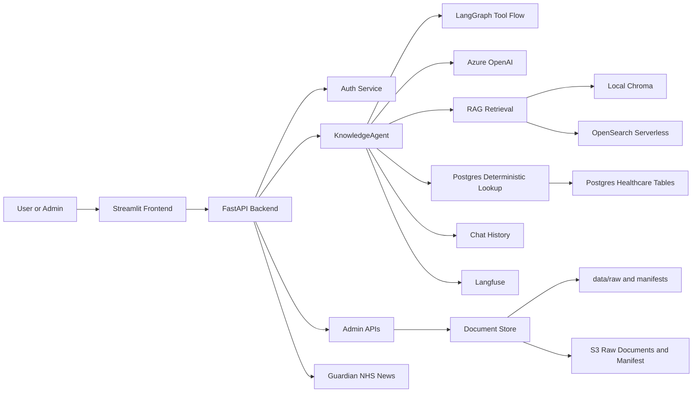

# Healthcare Knowledge Multi-Agent

Containerized healthcare knowledge assistant with a FastAPI backend, Streamlit frontend, LangGraph/LangChain agent orchestration, retrieval augmented generation, deterministic Postgres lookup, admin workflows, observability, and AWS deployment templates.

The application is built for internal healthcare knowledge work: staff can ask document and operational questions, while admins can manage users, upload and index documents, inspect query telemetry, and maintain structured lookup data.

## What It Does

- Authenticated chat with persistent sessions.
- Streamlit UI for chat, NHS news, dashboards, patient details, user administration, and document administration.
- FastAPI backend for auth, chat, ingestion, deterministic lookup, documents, dashboard data, and admin APIs.
- LangGraph/LangChain agent flow using Azure OpenAI chat models through `langchain-openai`.
- RAG over uploaded PDF, DOCX, markdown, text, and CSV content.
- Local Chroma vector search for development mode.
- OpenSearch Serverless vector and keyword retrieval for AWS mode.
- Postgres-backed deterministic lookup for patients, doctors, departments, contacts, appointments, wards, formulary rows, staff rota style data, and uploaded CSV rows.
- Role-aware document access and structured-data access filtering.
- Langfuse tracing, prompt loading, trace enrichment, and optional RAGAS score publishing.
- Offline golden dataset evaluation and stress testing.
- Docker Compose local stack and ECS Fargate deployment templates.

## Architecture



Local development uses local files, Chroma, `.env` credentials, and Postgres. AWS deployment uses Secrets Manager, S3, OpenSearch Serverless, IAM task roles, and the configured chat history backend.

For a deeper system explanation, see [docs/system_summary.md](docs/system_summary.md).

## Repository Layout

```text
backend/app/       FastAPI API, multi-agent graph, retrieval, auth, ingestion, storage, observability
backend/app/tooling/
                   Local tool definitions and registry boundary for future MCP tool execution
frontend/          Streamlit application
database/init/     Postgres schema and seed healthcare data
data/              Local document, Chroma, and local secret persistence
evals/             RAGAS golden dataset runner and stress test
infra/             ECS, IAM, CloudFormation, CodePipeline, RDS, S3, and OpenSearch templates
docs/              Architecture, SDLC, AWS, and system summary documentation
tests/             Unit and integration-style tests
```

The current project slug is `dstrmaysam-healthcare-knowledge-multi-agent`.

## Tool Execution Backend

Tools run locally by default. The backend can also expose the same tool names to the graph while forwarding execution to an external FastMCP server:

```env
TOOL_EXECUTION_BACKEND=local
MCP_TOOL_SERVER_URL=
MCP_TOOL_TIMEOUT_SECONDS=20
```

Set `TOOL_EXECUTION_BACKEND=mcp` and `MCP_TOOL_SERVER_URL` to the external FastMCP endpoint when tools are hosted out of process. The supervisor and specialist agents still choose the same backend tool names; only the execution transport changes.

## Quick Start

1. Copy the environment template:

```bash
cp .env.example .env
```

2. Fill in Azure OpenAI settings in `.env` if you want LLM answers and embeddings:

```env
AZURE_OPENAI_ENDPOINT=https://<your-resource>.openai.azure.com/
AZURE_OPENAI_API_KEY=<your-key>
AZURE_OPENAI_API_VERSION=2025-04-01-preview
AZURE_OPENAI_DEPLOYMENT=gpt-4.1-mini
AZURE_OPENAI_FAST_DEPLOYMENT=gpt-4.1-mini
AZURE_OPENAI_EMBEDDING_DEPLOYMENT=text-embedding-3-small
```

3. Start the stack:

```bash
docker compose up --build
```

4. Open the Streamlit UI:

```text
http://localhost:8501
```

Docker Compose starts:

- Backend API at `http://localhost:8000`
- Frontend UI at `http://localhost:8501`
- Postgres at `localhost:5432`

For local testing only, Compose enables a seeded admin overlay:

```text
Username: admin
Password: admin123
```

## Runtime Modes

The current code selects local resource implementations through `LOCAL_TEST_ADMIN_ENABLED`.

### Local Mode

Enabled by the Docker Compose default:

```env
APP_ENV=local
LOCAL_TEST_ADMIN_ENABLED=true
```

Local mode uses:

- `EnvSecretProvider`
- `.env` values for Azure OpenAI and Langfuse credentials
- `LOCAL_APP_SECRET_FILE` for app auth/session secrets
- `data/raw/` for uploaded raw documents
- `data/manifests/documents.json` for the manifest
- Chroma under `data/chroma`
- Postgres for deterministic lookup and chat history

If `LOCAL_APP_SECRET_FILE` does not exist, the backend creates it with a generated session secret and the configured local username/password.

### AWS Mode

Use AWS-backed resources by disabling the local overlay:

```env
APP_ENV=dev
SECRETS_STAGE=dev
LOCAL_TEST_ADMIN_ENABLED=false
```

AWS mode uses:

- AWS Secrets Manager for app, Azure OpenAI, and Langfuse secrets
- S3 for raw documents and the document manifest
- OpenSearch Serverless for vector and keyword retrieval
- RDS Postgres for deployed chat history and structured lookup storage
- ECS task roles for AWS credentials

Do not provide static AWS access keys to ECS tasks. Let the task role provide AWS credentials.

## Secret Model

Do not put API keys, passwords, token signing secrets, or Langfuse credentials in source code, Docker images, or Streamlit secrets.

Expected AWS secret names:

```text
/dstrmaysam-healthcare-knowledge-multi-agent/dev/app
/dstrmaysam-healthcare-knowledge-multi-agent/dev/azure-openai
/dstrmaysam-healthcare-knowledge-multi-agent/dev/langfuse
```

App secret shape:

```json
{
  "session_secret": "replace-with-long-random-value",
  "auth_users": {
    "admin": "pbkdf2_sha256$200000$salt_hex$hash_hex"
  },
  "user_profiles": {
    "admin": {
      "roles": ["admin", "doctor"],
      "departments": ["clinical_governance"],
      "password_change_required": false
    }
  }
}
```

Azure OpenAI secret shape:

```json
{
  "endpoint": "https://YOUR-RESOURCE.openai.azure.com/",
  "api_key": "azure-openai-key",
  "api_version": "2025-04-01-preview",
  "chat_deployment": "your-chat-deployment",
  "fast_chat_deployment": "optional-fast-chat-deployment",
  "embedding_deployment": "your-embedding-deployment"
}
```

Langfuse secret shape:

```json
{
  "public_key": "pk-lf-...",
  "secret_key": "sk-lf-...",
  "base_url": "https://cloud.langfuse.com"
}
```

Generate a password hash without storing the password:

```bash
python -m backend.app.auth hash-password
```

Inside the backend container:

```bash
python -m app.auth hash-password
```

## Chat And Agent Flow

Chat uses a single supervisor-led multi-agent graph. The frontend sends `query` and `session_id`; the backend supervisor LLM decides whether to call deterministic lookup, RAG, policy, catalog, or safety specialists before synthesis.

There is no online deterministic preflight shortcut and no user-selectable execution-mode switch. Exact operational lookup is handled by the graph-selected `DeterministicLookupAgent` through `postgres_deterministic_lookup`. If the supervisor tries to answer directly or route only to RAG for a clear structured lookup, in-graph deterministic guardrails force a `DeterministicLookupAgent` route before synthesis. A legacy `execution_mode` request field is tolerated for old clients, but it is ignored and normalized to supervisor routing.

Available tools include:

- `document_search` for approved document retrieval
- `policy_search` for policy, SOP, pathway, and guideline retrieval
- `catalogue_search` for manifest/catalog metadata
- `calendar_rota_lookup` for rota and calendar-style sources
- `formulary_table_lookup` for structured formulary data
- `postgres_deterministic_lookup` for exact healthcare and uploaded CSV lookup
- `safety_guard` for safety and escalation checks

The backend records tool usage, source snippets, trace IDs, token estimates, latency breakdowns, safety metadata, and RAGAS status with each chat interaction.

## API Surface

Core endpoints:

- `GET /health`
- `GET /news`
- `POST /auth/login`
- `GET /auth/me`
- `POST /auth/change-password`
- `POST /chat`
- `GET /chat/sessions`
- `GET /chat/sessions/{session_id}`
- `GET /documents`

Admin endpoints:

- `GET /admin/users`
- `POST /admin/users`
- `PATCH /admin/users/{username}`
- `POST /admin/users/{username}/reset-password`
- `POST /admin/documents/upload`
- `PATCH /admin/documents/metadata`
- `POST /admin/documents/ingest`
- `POST /admin/documents/delete-indexes`
- `GET /admin/dashboard`
- `GET /admin/patient-details`
- `POST /admin/warmup`

## Documents And Ingestion

Admins can upload PDF, DOCX, TXT, MD, and CSV files from the UI or API.

Non-CSV files are stored under the configured raw document prefix and indexed when ingestion runs. The ingestion job parses files, chunks text, embeds chunks, writes vectors to Chroma or OpenSearch, and updates the manifest.

CSV uploads are special:

- CSV rows are inserted into Postgres `uploaded_lookup_rows`.
- A metadata-only manifest record is added.
- The rows become available to `postgres_deterministic_lookup`.
- Deleting indexes also deletes uploaded lookup rows.

Run ingestion manually from the backend container:

```bash
docker compose run --rm backend python -m app.ingest
```

## Deterministic Lookup Data

Local mock healthcare data is created by:

- `database/init/01_schema.sql`
- `database/init/02_seed.sql`

Structured lookup covers:

- patient details by name, MRN, or NHS number
- doctor and consultant details
- department and escalation contacts
- organization directory entries
- appointments and clinic slots
- ward locations, beds, and phone numbers
- formulary and restricted medicine facts
- uploaded CSV rows for exact counts, lists, and table-like questions

Example questions:

- "What is the phone number for ICU outreach?"
- "Which doctor is on call for Cardiology?"
- "Show patient details for MRN10003."
- "Does Leo Bennett have any appointments?"
- "Where is ward W05?"
- "Is vancomycin restricted?"
- "How many ventilators are available?"

## Chat History And Observability

Set `CHAT_HISTORY_BACKEND` to choose persistence:

- `dynamodb_postgres`: DynamoDB primary, Postgres fallback
- `dynamodb`: DynamoDB only
- `postgres`: Postgres only
- `memory`: process memory only, not durable

If Langfuse trace updates fail, the backend writes pending trace payloads to the Postgres `langfuse_trace_outbox` table for later retry. Chat message persistence is independent of Langfuse availability.

## Evaluation And Testing

Run the unit test suite:

```bash
python -m pytest tests -q
```

Run compile validation:

```bash
python -m compileall backend frontend tests -q
```

Run the golden-data RAGAS eval after the API is running:

```bash
python evals/run_ragas_eval.py --api-url http://localhost:8000 --token YOUR_TOKEN
```

Use the healthcare dataset:

```bash
python evals/run_ragas_eval.py --dataset evals/healthcare_golden_dataset.csv --api-url http://localhost:8000 --token YOUR_TOKEN
```

Publish per-question and summary RAGAS scores to Langfuse:

```bash
python evals/run_ragas_eval.py --api-url http://localhost:8000 --token YOUR_TOKEN --publish-langfuse --secrets-stage dev
```

Run the stress test:

```bash
python evals/stress_test.py --api-url http://localhost:8000 --token YOUR_TOKEN
```

## AWS Deployment

High-level steps:

1. Deploy the CloudFormation template in `infra/cloudformation/` with your GitHub CodeStar connection, VPC, and subnet parameters.
2. CodePipeline pulls from GitHub, CodeBuild builds backend/frontend images, pushes them to ECR, and emits CodeDeploy ECS artifacts.
3. CodeDeploy performs blue/green ECS Fargate deployments behind the Application Load Balancer.
4. Runtime storage uses S3, OpenSearch Serverless, Secrets Manager, and RDS Postgres. DynamoDB is not part of the new deployment path.
5. Set `LOCAL_TEST_ADMIN_ENABLED=false` in ECS.

See [infra/README.md](infra/README.md), [docs/aws_cicd_deployment.md](docs/aws_cicd_deployment.md), and [docs/aws_setup_instructions.md](docs/aws_setup_instructions.md).

## Useful Docs

- [System summary](docs/system_summary.md)
- [AWS setup instructions](docs/aws_setup_instructions.md)
- [Multi-agent conversion proposal](docs/multi_agent_conversion_proposal.md)
- [Multi-agent implementation plan](docs/multi_agent_conversion_implementation_plan.md)
