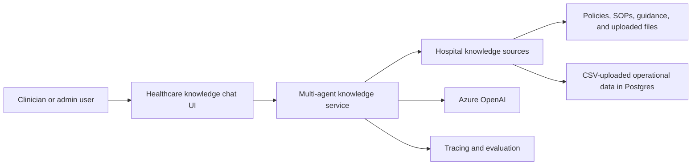
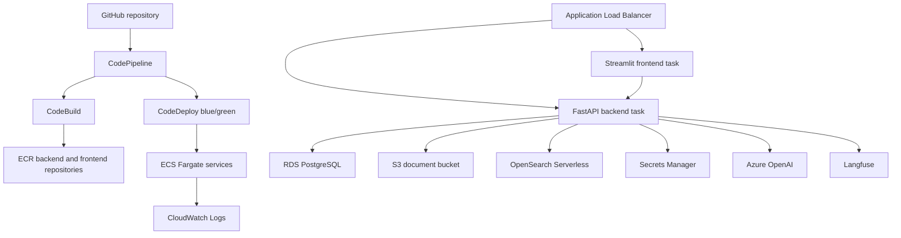
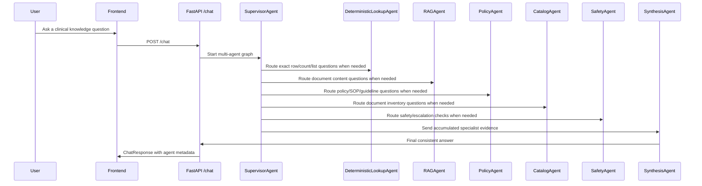
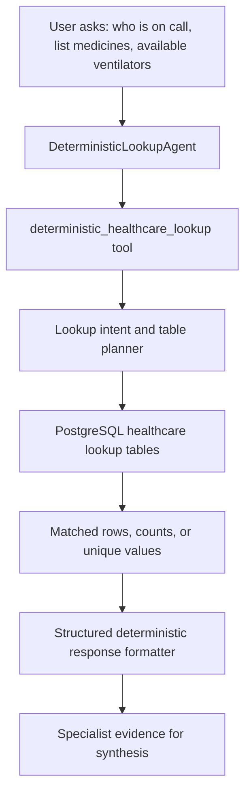
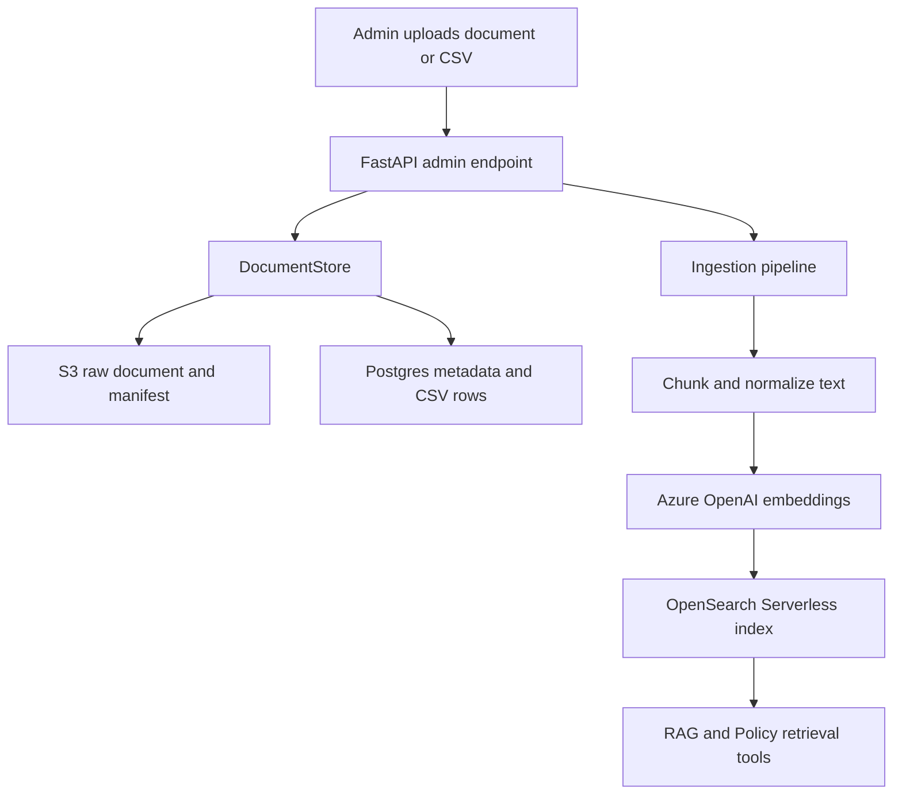
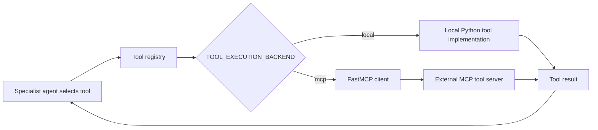
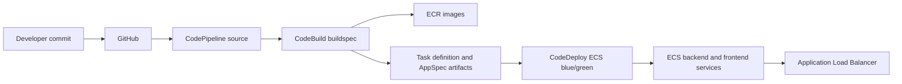
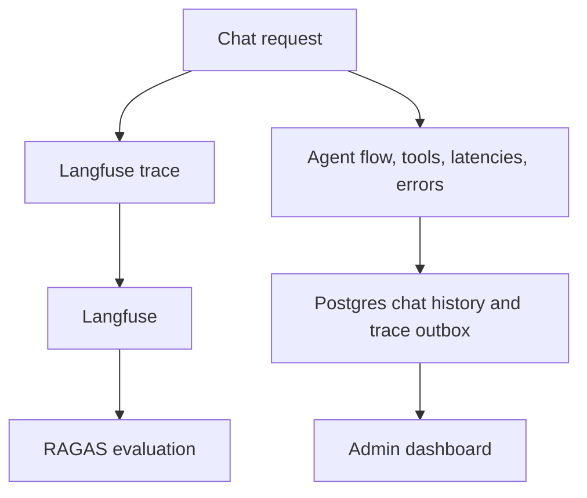

# AWS Multi-Agent Architecture

Project: `dstrmaysam-healthcare-knowledge-multi-agent`

This document describes the high-level and low-level design for the multi-agent healthcare knowledge system deployed on AWS.

## HLD 1: Stakeholder View

The stakeholder view has four main ideas:

- Users ask questions in one chat interface.
- The backend supervisor decides which specialist agent should handle each part of the question.
- The system uses hospital documents, structured operational rows, and Azure OpenAI to answer.
- Tracing, saved chat history, and evaluation data support audit and improvement.

## HLD 2: Technical AWS View

The AWS deployment uses CodePipeline from GitHub, container images in ECR, blue/green ECS deployments through CodeDeploy, and runtime services for storage, retrieval, secrets, and observability. DynamoDB is not part of the new deployment path; RDS PostgreSQL is used instead.

## LLD 1: Online Chat Request

Every online request enters the supervisor-led graph. Deterministic lookup is a normal specialist path, not a preflight shortcut. The supervisor may call more than one specialist for multipart questions before synthesis.

## LLD 2: Deterministic Lookup

CSV rows are inserted during upload and ingestion. Query execution reads existing PostgreSQL rows; it does not append rows during chat.

Important lookup behavior:

- Availability questions filter to the requested equipment or medicine.
- On-call questions search staff schedule rows where `on_call=Yes`.
- Listing questions return unique instances first.
- Large lookup results use a concise first section and an expandable full-details section.
- The specialist returns structured evidence so synthesis can keep answer format consistent.

## LLD 3: Document Ingest And Retrieval

Documents are stored in S3 and indexed into OpenSearch Serverless. CSV uploads populate PostgreSQL lookup tables during upload/ingestion, not during chat.

## LLD 4: Tool Execution Boundary

The supervisor and specialist agents see stable tool names. The execution backend decides whether the tool runs in-process or is forwarded to a FastMCP server.

## LLD 5: CI/CD Deployment

CodeBuild renders deployment artifacts with the runtime values produced by CloudFormation. CodeDeploy then swaps traffic between blue and green target groups.

## LLD 6: Observability And Evaluation

The backend saves agent flow, agents used, supervisor decisions, tool names, latency fields, and errors. If Langfuse publishing fails, pending trace updates are written to the Postgres outbox for retry.

## Editable Diagram Sources

The corresponding editable draw.io files are:

- `docs/aws_hld_stakeholder.drawio`
- `docs/aws_hld_technical.drawio`
- `docs/aws_lld_processes.drawio`
- `docs/aws_lld_lookup_ingest_observability.drawio`

The generated PDF version is:

- `docs/aws_multi_agent_architecture.pdf`
