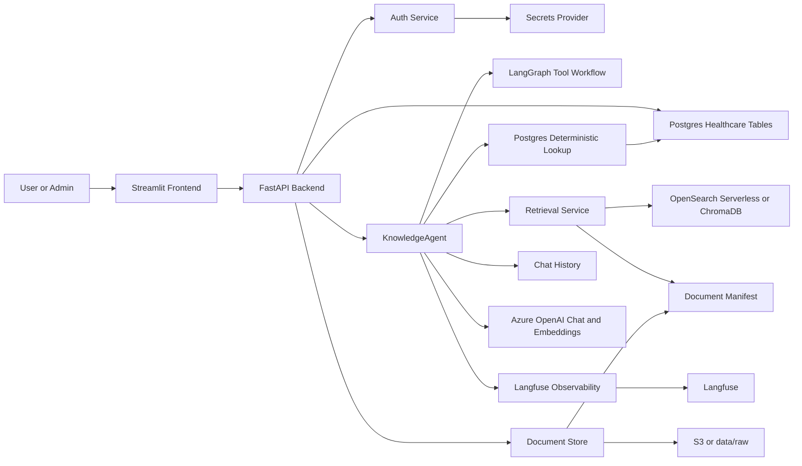
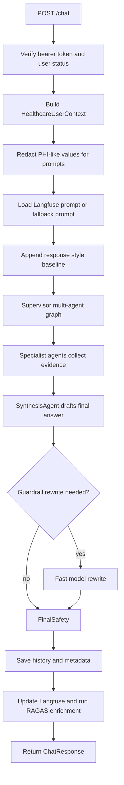
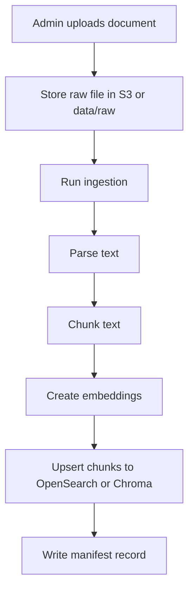
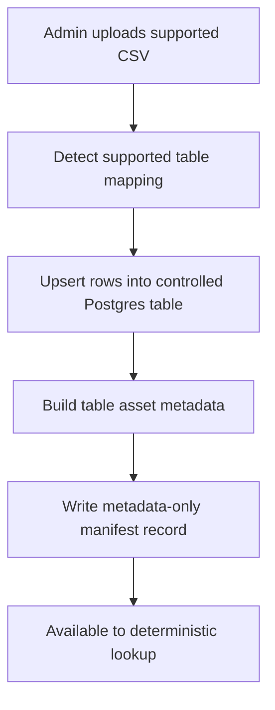

# Healthcare Knowledge Agent System Summary

Generated for the `dstrmaysam-healthcare-knowledge-agent` project.

## 1. Overview

The Healthcare Knowledge Agent is a containerized internal assistant for healthcare document Q&A, operational lookup, policy search, patient-oriented admin dashboards, document administration, observability, and evaluation.

It combines:

- A Streamlit frontend for chat, NHS news, admin dashboards, patient details, users, and documents.
- A FastAPI backend for authentication, chat orchestration, document ingestion, deterministic lookup, tracing, admin APIs, and news.
- A `KnowledgeAgent` that uses LangGraph/LangChain with Azure OpenAI chat models.
- RAG over uploaded documents using Chroma locally or OpenSearch Serverless in AWS.
- Postgres deterministic lookup for structured healthcare tables and uploaded CSV rows.
- Langfuse tracing, prompt loading, trace enrichment, and optional RAGAS scoring.
- Docker Compose for local development and ECS/Fargate templates for AWS deployment.

The system has two practical runtime profiles:

- Local profile: local files, Chroma, `.env` credentials, local app secret file, and Postgres.
- AWS profile: Secrets Manager, S3, OpenSearch Serverless, DynamoDB or Postgres chat history, and ECS task roles.

## 2. Main Capabilities

- Authenticated chat with persistent chat sessions.
- Admin user management with roles, departments, password resets, and first-login password change support.
- Single supervisor-led chat routing: the supervisor LLM chooses deterministic lookup, RAG, policy, catalog, or safety specialists before synthesis.
- Document upload, metadata editing, ingestion, indexing, and full index deletion.
- Role-aware document access through `allowed_roles` metadata.
- Catalog-guided RAG for documents, policies, SOPs, pathways, and guidelines.
- Local vector search through ChromaDB.
- AWS vector and keyword retrieval through OpenSearch Serverless.
- Structured lookup against Postgres healthcare tables.
- Uploaded CSV lookup rows stored in Postgres and represented in the document manifest as metadata-only assets.
- Guardian NHS news feed surfaced in the frontend.
- Admin dashboard with query, latency, token, model, trace, tool flow, agent flow, source, safety, and RAGAS metadata.
- Patient details dashboard over Postgres healthcare tables.
- Golden dataset evaluation and 100-query stress testing.

## 3. High-Level Architecture



## 4. Repository Map

| Path | Purpose |
| --- | --- |
| `backend/app/main.py` | FastAPI app, dependency wiring, auth, chat, admin, documents, dashboard, and news routes |
| `backend/app/agent.py` | Main `KnowledgeAgent`, supervisor orchestration, tool flow, guardrails, metadata, and fallback answers |
| `backend/app/healthcare_tools.py` | Healthcare-specific agent tools |
| `backend/app/tools.py` | Base agent tools and retrieval formatting |
| `backend/app/retrieval.py` | OpenSearch retrieval service with vector, keyword, neighbor chunks, and caching |
| `backend/app/local_chroma.py` | Local Chroma ingestion and retrieval |
| `backend/app/ingest.py` | Document parsing, chunking, checksums, metadata inference, and OpenSearch ingestion |
| `backend/app/storage.py` | S3 and local document stores plus manifests |
| `backend/app/deterministic_lookup.py` | Exact Postgres lookup over healthcare tables and uploaded CSV rows |
| `backend/app/history.py` | Memory, DynamoDB, Postgres, and fallback chat history repositories |
| `backend/app/auth.py` | Password hashing, token creation, user and role management |
| `backend/app/secrets.py` | AWS Secrets Manager provider and local environment/file provider |
| `backend/app/observability.py` | Langfuse trace handling and trace outbox support |
| `backend/app/ragas_scoring.py` | Live RAGAS scoring with lexical fallback |
| `frontend/streamlit_app.py` | Streamlit UI pages and backend API client |
| `database/init/` | Postgres schema and seed data |
| `evals/` | RAGAS eval runner, datasets, and stress test |
| `infra/` | AWS templates for ECS, IAM, DynamoDB, and OpenSearch |
| `tests/` | Test coverage for auth, storage, retrieval, ingestion, observability, local mode, RAGAS, and agent contract |

## 5. Runtime Modes

### Local Profile

Docker Compose defaults to:

```env
APP_ENV=local
LOCAL_TEST_ADMIN_ENABLED=false
```

In current code, `AppSettings.use_local_resources()` returns `LOCAL_TEST_ADMIN_ENABLED`. With the current `.env` value of `false`, the app runs in local containers but uses the AWS-style secret/provider path unless overridden. Set `LOCAL_TEST_ADMIN_ENABLED=true` only when you intentionally want fully local secret/resource fallbacks.

Local profile uses:

- `EnvSecretProvider`
- `.env` values for Azure OpenAI and Langfuse
- `data/local_app_secret.json` for app auth/session secrets
- `data/raw/` for uploaded source documents
- `data/manifests/documents.json` for the document manifest
- ChromaDB under `data/chroma`
- Postgres for deterministic lookup and chat history

Local uploads are constrained under `LOCAL_DATA_DIR`; path traversal is rejected before local file reads/writes.

### AWS Profile

AWS profile is selected by setting:

```env
APP_ENV=dev
SECRETS_STAGE=dev
LOCAL_TEST_ADMIN_ENABLED=false
```

AWS profile uses:

- AWS Secrets Manager for app, Azure OpenAI, and Langfuse secrets.
- S3 for raw documents and the document manifest.
- OpenSearch Serverless for indexed chunks.
- RDS Postgres for chat history and deterministic lookup tables.
- ECS task role credentials for AWS API calls.

Important AWS names used by defaults and docs:

```env
S3_BUCKET=dstrmaysam-healthcare-knowledge-multi-agent-dev
OPENSEARCH_INDEX=dstrmaysam-healthcare-knowledge-multi-agent-dev
CHAT_HISTORY_BACKEND=postgres
APP_SECRET_NAME=/dstrmaysam-healthcare-knowledge-multi-agent-dev/app
AZURE_OPENAI_SECRET_NAME=/dstrmaysam-healthcare-knowledge-multi-agent-dev/azure-openai
LANGFUSE_SECRET_NAME=/dstrmaysam-healthcare-knowledge-multi-agent-dev/langfuse
```

## 6. Frontend Workflow

The frontend is a Streamlit app with role-aware navigation.

Public unauthenticated page:

- Sign in.
- NHS news carousel when Guardian news is available.

Authenticated non-admin pages:

- Chat.
- News.

Admin pages:

- Chat.
- News.
- Dashboard.
- Patient Details.
- Users.
- Documents.

Chat page behavior:

1. Sends `query` and `session_id` to `POST /chat`.
2. Shows progress messages while the backend request is running.
3. Stores the returned session ID.
4. Displays the assistant answer.
5. Lists previous chat sessions in the sidebar.

Documents page behavior:

1. Loads indexed document records through `GET /documents`.
2. Uploads selected files through `POST /admin/documents/upload`.
3. Edits document category, document type, and allowed roles through `PATCH /admin/documents/metadata`.
4. Runs ingestion through `POST /admin/documents/ingest`.
5. Deletes all indexes through `POST /admin/documents/delete-indexes` after admin password confirmation.

Dashboard page behavior:

1. Loads query analytics through `GET /admin/dashboard`.
2. Filters by range and user.
3. Shows aggregate counts and latency/token metrics.
4. Shows tool usage, agent usage, model usage, RAGAS metrics, trace IDs, sources, safety metadata, and latency breakdowns.

## 7. Backend API Surface

Core endpoints:

- `GET /health`
- `GET /news`
- `POST /auth/login`
- `GET /auth/me`
- `POST /auth/change-password`
- `POST /chat`
- `GET /chat/sessions`
- `GET /chat/sessions/{session_id}`
- `GET /documents`

Admin endpoints:

- `GET /admin/users`
- `POST /admin/users`
- `PATCH /admin/users/{username}`
- `POST /admin/users/{username}/reset-password`
- `POST /admin/documents/upload`
- `PATCH /admin/documents/metadata`
- `POST /admin/documents/ingest`
- `POST /admin/documents/delete-indexes`
- `GET /admin/dashboard`
- `GET /admin/patient-details`
- `POST /admin/warmup`

## 8. Authentication And Authorization

The backend uses bearer tokens created by `backend/app/auth.py`.

User records contain:

- username
- password hash
- roles
- departments
- `password_change_required`

Known roles include:

- `admin`
- `staff`
- `doctor`
- `nurse`
- `pharmacy`
- `clinical_governance`
- `manager`

Admin-only APIs require the `admin` role. Active user APIs reject users with `password_change_required=true` until they change their password.

Password hashes use PBKDF2 SHA-256 strings. Generate a hash with:

```bash
python -m backend.app.auth hash-password
```

## 9. Chat Request And Response Shape

Request:

```json
{
  "query": "How many ventilators do we have?",
  "session_id": "optional-existing-session-id"
}
```

The legacy `execution_mode` field is tolerated for old clients, but `/chat` ignores it and normalizes execution metadata to `supervisor`.

Response includes:

- `session_id`
- `answer`
- `sources`
- `tools_used`
- `input_tokens`
- `output_tokens`
- `latency_ms`
- `trace_id`
- `safety`
- `audit_event`
- `performance`
- `latency_breakdown`

Source objects include:

- `title`
- `uri`
- `score`
- `metadata`
- `snippet`

The `snippet` field is important for citations, dashboard inspection, and RAGAS context scoring.

## 10. Chat Workflow



There is no online deterministic preflight shortcut. Structured operational facts such as patient details, rota facts, appointments, wards, contacts, equipment, uploaded CSV rows, and formulary facts must come from the graph-selected `DeterministicLookupAgent` or retrieved evidence rather than prior chat memory. If the supervisor tries to answer directly or routes only to RAG for a clear structured lookup, in-graph deterministic guardrails force a `DeterministicLookupAgent` route before synthesis. Offline/no-LLM fallback can still use deterministic lookup because no supervisor LLM is available.

## 11. Agent And Tool Flow

The main agent lives in `KnowledgeAgent`.

Key stages:

1. Create or reuse a trace ID.
2. Load chat history for the user/session.
3. Load the configured system prompt from Langfuse when available.
4. Add static response style requirements.
5. Enter the supervisor-led multi-agent graph for online LLM-backed chat.
6. Let the supervisor choose the first specialist through LLM routing, with deterministic guardrails for exact structured lookup, list, count, row-value, medicine, rota, patient, ward, equipment, and uploaded CSV questions.
7. Run selected specialists and return to the supervisor until enough evidence exists or the agent-step limit is reached.
8. Have `SynthesisAgent` generate the final answer from accumulated specialist evidence.
9. Apply response guardrail rewrite when needed.
10. Save chat, trace metadata, latency metrics, source snippets, tool flow, agent flow, and optional RAGAS scores.

Tool flow is recorded at two levels:

- `tools_used`: tools actually selected by the agent or execution path.
- `tool_flow`: lower-level execution details, including internal catalog guidance used to narrow RAG searches.

## 12. Agent Tools

### `document_search`

Semantic search over approved healthcare documents. It retrieves indexed chunks through the configured retrieval backend and applies role-based filtering.

### `policy_search`

Focused retrieval over clinical policies, admin policies, compliance documents, SOPs, pathways, and guidelines. It prefers documents whose metadata `domain` or `document_type` indicates policy-like content.

### `catalogue_search`

Searches document manifest metadata. It is useful for questions about available departments, services, owners, systems, and approved tools. The catalog is also used internally to narrow RAG searches.

### `calendar_rota_lookup`

Looks up calendar, clinic, training, on-call, and rota-style data from approved CSV sources. Staff availability and rota questions can use deterministic Postgres lookup when appropriate.

### `formulary_table_lookup`

Looks up formulary rows, restricted medicines, approval requirements, maximum adult dose fields, and monitoring requirements.

### `postgres_deterministic_lookup`

Exact lookup over Postgres healthcare data and uploaded CSV rows. It handles patient, appointment, doctor, ward, department, contact, formulary, directory, count, list, and uploaded table-style queries.

### `safety_guard`

Assesses clinical risk, missing sources, PHI exposure, and escalation needs.

### Base Tools

The base tool set also includes:

- `rag_search`
- `document_catalog`
- `table_lookup`

Healthcare tool descriptions are richer and are the main tools exposed to the healthcare agent path.

## 13. Retrieval Strategy

OpenSearch retrieval:

1. Ensure the OpenSearch index exists.
2. Embed the query with Azure OpenAI embeddings.
3. Run kNN vector search when embeddings are available.
4. Run keyword multi-match search across text, title, key, and metadata.
5. Use `msearch` or parallel search when enabled.
6. Apply document-key filters when catalog candidates exist.
7. Merge duplicate hits.
8. Fetch neighbor chunks according to `RAG_NEIGHBOR_CHUNKS`.
9. Return ranked `RetrievalHit` objects.

Local Chroma retrieval:

1. Embed the query with Azure OpenAI embeddings.
2. Query the persistent Chroma collection.
3. Apply document-key filtering when supplied.
4. Fall back to keyword search over Chroma contents or raw local files if needed.
5. Fetch neighbor chunks.
6. Return the same `RetrievalHit` shape as OpenSearch.

Relevant settings:

```env
RAG_TOP_K=10
RAG_NEIGHBOR_CHUNKS=1
RAG_QUERY_CACHE_TTL_SECONDS=60
RAG_EMBEDDING_CACHE_SIZE=512
RAG_CONTEXT_MAX_CHARS=9000
RAG_SNIPPET_CHARS=900
RAG_PARALLEL_SEARCH_ENABLED=true
```

## 14. Document Upload And Ingestion

Supported upload extensions:

- `.pdf`
- `.docx`
- `.txt`
- `.md`
- `.csv`

Non-CSV document flow:



CSV upload flow:



CSV files are retained only after successful validation/sync. Chat lookup uses controlled Postgres tables rather than arbitrary CSV row blobs.

Ingestion is incremental:

- Unchanged files are skipped by checksum.
- Changed files are deleted and reindexed.
- Removed source files remove their indexed chunks.
- Backend changes in vector backend/index/collection can force reindexing.

## 15. Chunking Strategy

Default chunk settings:

```env
INGESTION_CHUNK_SIZE=1500
INGESTION_CHUNK_OVERLAP=250
```

Implementation:

- Primary splitter: LangChain `RecursiveCharacterTextSplitter`.
- Fallback splitter: fixed-size sliding text window.
- Minimum chunk size is clamped to `300`.
- Overlap is clamped below the chunk size.

Chunk records store:

- document key
- title
- URI
- content type
- checksum
- chunk index
- metadata
- text
- embedding vector

## 16. Data Stores

### Postgres Healthcare Tables

Defined in `database/init/01_schema.sql`.

| Table | Purpose |
| --- | --- |
| `departments` | Department directory, locations, phones, service leads, escalation contacts |
| `doctors` | Doctor and consultant directory, specialties, contacts, on-call status |
| `wards` | Ward directory, floors, bed capacity, available beds, nurse in charge |
| `patients` | Patient details, MRN, NHS number, ward, consultant, status, risk flags |
| `organization_contacts` | Escalation contacts and organization directory |
| `appointments` | Appointment lookup by patient, clinic, date, clinician, status |
| `formulary` | Medicine facts, restrictions, approval, dose, monitoring |
| Operational lookup tables | Supported CSV uploads upsert into controlled tables such as staff schedule, clinic sessions, equipment assets, finance, compliance, training, contacts, wards, and formulary |

### Chat History Tables

Postgres chat history uses:

- `chat_sessions`
- `chat_messages`
- `chat_interactions`
- `langfuse_trace_outbox`

DynamoDB history uses a single-table shape with:

- partition key `user_id`
- sort key values such as `SESSION#...` and `MESSAGE#...`

### Document Manifest

AWS path:

```text
s3://<S3_BUCKET>/<S3_MANIFEST_KEY>
```

Local path:

```text
data/manifests/documents.json
```

Common manifest fields:

- `documents`
- `indexed_chunks`
- `total_chunks`
- `indexed_documents`
- `skipped_documents`
- `deleted_documents`
- `deleted_chunks`
- `force_reindex`

Document records contain:

- `key`
- `title`
- `uri`
- `content_type`
- `checksum`
- `metadata`
- `chunk_count`
- `ingestion_status`

### OpenSearch Chunk Mapping

OpenSearch stores:

- `key`
- `title`
- `uri`
- `text`
- `content_type`
- `chunk_index`
- `checksum`
- `metadata`
- `embedding`

The default vector dimension is `1536`, matching `text-embedding-3-small`.

### Chroma Metadata

Local Chroma stores:

- chunk text
- embedding vector
- `key`
- `title`
- `uri`
- `chunk_index`
- `checksum`
- `content_type`
- flattened metadata
- `metadata_json`

## 17. Access Control

Users have roles and departments. Documents can define `allowed_roles` in metadata.

Document access behavior:

- If `allowed_roles` is present and non-empty, the user must have at least one matching role.
- If `allowed_roles` is absent or empty, the document is broadly available subject to other checks.

Structured row access behavior:

- Postgres rows include `access_level`.
- The deterministic lookup service converts the user context into allowed access scopes.
- Queries filter rows before returning results.

The default local admin user has broad local roles so development can exercise all workflows.

## 18. Observability And Dashboard Metadata

Saved metadata can include:

- `trace_id`
- `user_id`
- `session_id`
- `chat_execution_mode`
- `chat_execution_mode_label`
- `agent_mode`
- `tools_used`
- `tool_flow`
- `agent_flow`
- `supervisor_decisions`
- `agent_latencies_ms`
- `agent_errors`
- `model`
- `prompt_label`
- `input_tokens`
- `output_tokens`
- `latency_ms`
- `latency_breakdown`
- `sources`
- `source_document_keys`
- `ragas`
- `ragas_status`
- `safety`
- `audit_event`

If Langfuse trace updates fail, the payload is written to `langfuse_trace_outbox` with `status='pending'` for retry.

## 19. Safety And Guardrails

The agent includes several healthcare-oriented safeguards:

- PHI-like prompt redaction before model calls.
- User-context-aware source access control.
- Safety assessment for clinical risk and missing-source situations.
- Response style baseline appended to prompts.
- Response guardrail rewrite when risky style or persona terms are detected.
- Audit metadata recorded with chat interactions.

The system is an internal knowledge assistant. It is not a replacement for clinical judgment, live clinical systems, emergency escalation pathways, or prescribing governance.

## 20. Caching And Warmup

Caching settings:

- `DOCUMENT_MANIFEST_CACHE_TTL_SECONDS`
- `LANGFUSE_PROMPT_CACHE_TTL_SECONDS`
- `RAG_QUERY_CACHE_TTL_SECONDS`
- `RAG_EMBEDDING_CACHE_SIZE`
- agent catalog candidate cache

Warmup settings:

```env
CHAT_WARMUP_ENABLED=true
CHAT_WARMUP_LLM_CALL_ENABLED=true
CHAT_WARMUP_RETRIEVAL_ENABLED=true
```

Background settings:

```env
CHAT_BACKGROUND_HISTORY_SAVE_ENABLED=true
LANGFUSE_BACKGROUND_TRACE_UPDATE_ENABLED=true
```

These settings reduce answer-path latency by caching repeated work and moving enrichment work out of the synchronous response path where possible.

## 21. Evaluation

RAGAS is implemented in:

1. Live background scoring after chat responses.
2. Offline golden dataset evaluation through `evals/run_ragas_eval.py`.

Scores include:

- `ragas_faithfulness`
- `ragas_answer_relevancy`
- `ragas_context_precision`
- `ragas_context_recall`
- `simple_expected_overlap`

RAGAS depends on retrieved context. The `/chat` response includes `source.snippet` values so evaluation can score against source content rather than only source URIs.

Stress testing uses `evals/stress_test.py` to run paraphrased workloads and report latency, failures, source overlap, and answer similarity.

## 22. Local Runbook

1. Copy `.env.example` to `.env`.
2. Add Azure OpenAI credentials for chat and embeddings.
3. Optionally add Langfuse credentials.
4. Start Docker Compose:

```bash
docker compose up --build
```

5. Open:

```text
http://localhost:8501
```

6. Log in with the local admin user:

```text
admin / admin123
```

7. Upload documents from the Documents page.
8. Run ingestion from the Documents page or with:

```bash
docker compose run --rm backend python -m app.ingest
```

9. Ask questions from the Chat page.

Useful local endpoints:

```text
Backend:  http://localhost:8000
Frontend: http://localhost:8501
Postgres: localhost:5432
```

## 23. AWS Deployment Runbook

At a high level:

1. Deploy `infra/aws-foundation.yml`.
2. Populate Secrets Manager values.
3. Initialize RDS Postgres with `database/init/01_schema.sql` and `database/init/02_seed.sql`.
4. Build and push backend/frontend images to the single ECR repository.
5. Confirm OpenSearch Serverless collection output and run ingestion to create/index chunks.

Secrets Manager entries:

```text
/dstrmaysam-healthcare-knowledge-multi-agent-dev/app
/dstrmaysam-healthcare-knowledge-multi-agent-dev/azure-openai
/dstrmaysam-healthcare-knowledge-multi-agent-dev/langfuse
```

6. Deploy ECS services with:

```env
LOCAL_TEST_ADMIN_ENABLED=false
APP_ENV=dev
SECRETS_STAGE=dev
```

7. Ensure the ECS task role can access:

- app, Azure OpenAI, and Langfuse secrets
- S3 bucket and manifest object
- RDS Postgres access through networking and injected database secret
- OpenSearch Serverless collection/index
- CloudWatch logs

8. Do not provide static AWS access keys to ECS.

## 24. Test And Evaluation Commands

Run unit tests:

```bash
python -m pytest tests -q
```

Run compile validation:

```bash
python -m compileall backend frontend tests -q
```

Run RAGAS evaluation after the API is running:

```bash
python evals/run_ragas_eval.py --api-url http://localhost:8000 --token YOUR_TOKEN
```

Run the healthcare dataset:

```bash
python evals/run_ragas_eval.py --dataset evals/healthcare_golden_dataset.csv --api-url http://localhost:8000 --token YOUR_TOKEN
```

Publish scores to Langfuse:

```bash
python evals/run_ragas_eval.py --api-url http://localhost:8000 --token YOUR_TOKEN --publish-langfuse --secrets-stage dev
```

Run stress testing:

```bash
python evals/stress_test.py --api-url http://localhost:8000 --token YOUR_TOKEN
```

## 25. Operational Notes

- If chat says Azure OpenAI deployment is missing, check `AZURE_OPENAI_DEPLOYMENT`, `AZURE_OPENAI_ENDPOINT`, and `AZURE_OPENAI_API_KEY`.
- If local mode unexpectedly calls AWS, check `LOCAL_TEST_ADMIN_ENABLED`; current `.env` sets it to `false`, which selects the AWS-style provider path.
- If AWS mode still uses local files or `.env` secrets, check that `LOCAL_TEST_ADMIN_ENABLED=false` is reaching the backend container.
- If OpenSearch authorization fails, check IAM permissions and OpenSearch Serverless data access policy.
- If documents do not appear in RAG results, confirm ingestion completed and the manifest contains nonzero `chunk_count`.
- If RAGAS scores are weak, inspect whether returned sources contain meaningful `snippet` values.
- If deterministic lookup misses structured facts, confirm rows exist in the relevant Postgres operational table and that manifest metadata points to the table asset.
- If ingestion skips a document, compare its checksum in the manifest; unchanged files are intentionally skipped.
- If changing the OpenSearch index or Chroma collection, run ingestion again so chunks are created in the new target.
